# 🎯 Parallelizable Polynomial Root Finding

## A Deep Dive into the ginger-cpp Library

**ginger-cpp: Polynomial Root-Finding Algorithms (Parallelizable)**

📅 Presentation Duration: **45 minutes**

---

<!-- slide -->

# 📋 Agenda

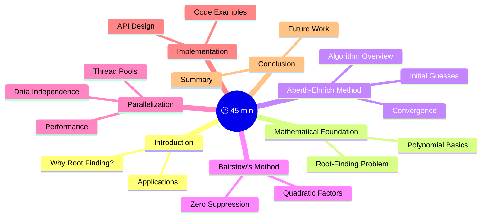

---

<!-- slide -->

# 🌍 Part 1: Introduction

---

## 🎯 Why Polynomial Root Finding?

### The Problem

Finding roots of polynomials is fundamental in:

| Domain | Application |
|--------|-------------|
| 🔬 **Physics** | Quantum mechanics, signal processing |
| 📡 **Control Theory** | System stability analysis |
| 📊 **Statistics** | Time series analysis (AR models) |
| 🎮 **Computer Graphics** | Curve intersection |
| 🔧 **Engineering** | Circuit analysis, structural dynamics |

### Challenges

- 📈 **High-degree polynomials** → Multiple roots
- 🔢 **Complex roots** → Need complex arithmetic
- ⚡ **Real-time applications** → Speed critical
- 🎯 **Accuracy requirements** → Numerical stability

---

## 📦 The ginger-cpp Library

### Features

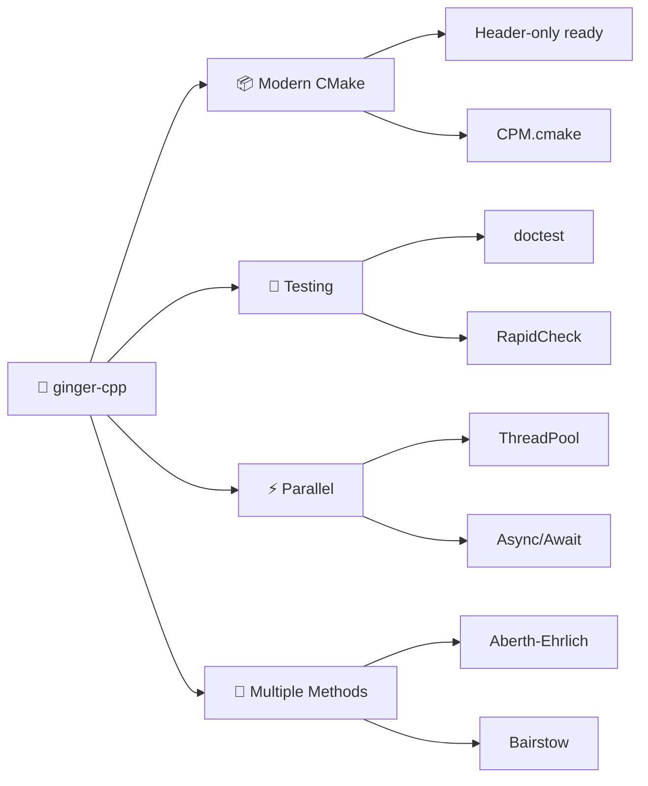

### Supported Algorithms

| Method | Roots | Parallel | Use Case |
|--------|-------|----------|----------|
| `aberth_mt` | Complex | ✅ | General polynomials |
| `aberth_autocorr_mt` | Complex | ✅ | Auto-correlation |
| `pbairstow_even` | Real pairs | ✅ | Even-degree real |

---

<!-- slide -->

# 🔬 Part 2: Mathematical Foundation

---

## 📐 Polynomial Representation

### Standard Form

A polynomial of degree $n$:

$$P(x) = a_n x^n + a_{n-1} x^{n-1} + \cdots + a_1 x + a_0$$

where $a_n \neq 0$

### Coefficients Vector

In ginger-cpp, coefficients are stored in descending order:

```cpp
// P(x) = 2x³ + 3x² - x + 5
std::vector<double> coeffs = {2, 3, -1, 5};
//                indices:    [0]  [1]   [2]   [3]
//                powers:      3    2     1     0
```

### Root Classification

$$P(x) = a_n \prod_{i=1}^{n} (x - r_i)$$

| Root Type | Example | Method Required |
|-----------|---------|-----------------|
| 🔵 Real | $r = 3.5$ | Bairstow |
| 🔴 Complex | $r = 2 + 3i$ | Aberth |
| ⚪ Multiple | $r = 2$ (multiplicity 3) | Special handling |

---

## 🔢 The Root-Finding Problem

### Goal

Find all $n$ roots $r_1, r_2, \ldots, r_n$ such that:

$$P(r_i) = 0 \quad \text{for } i = 1, 2, \ldots, n$$

### Iterative Methods

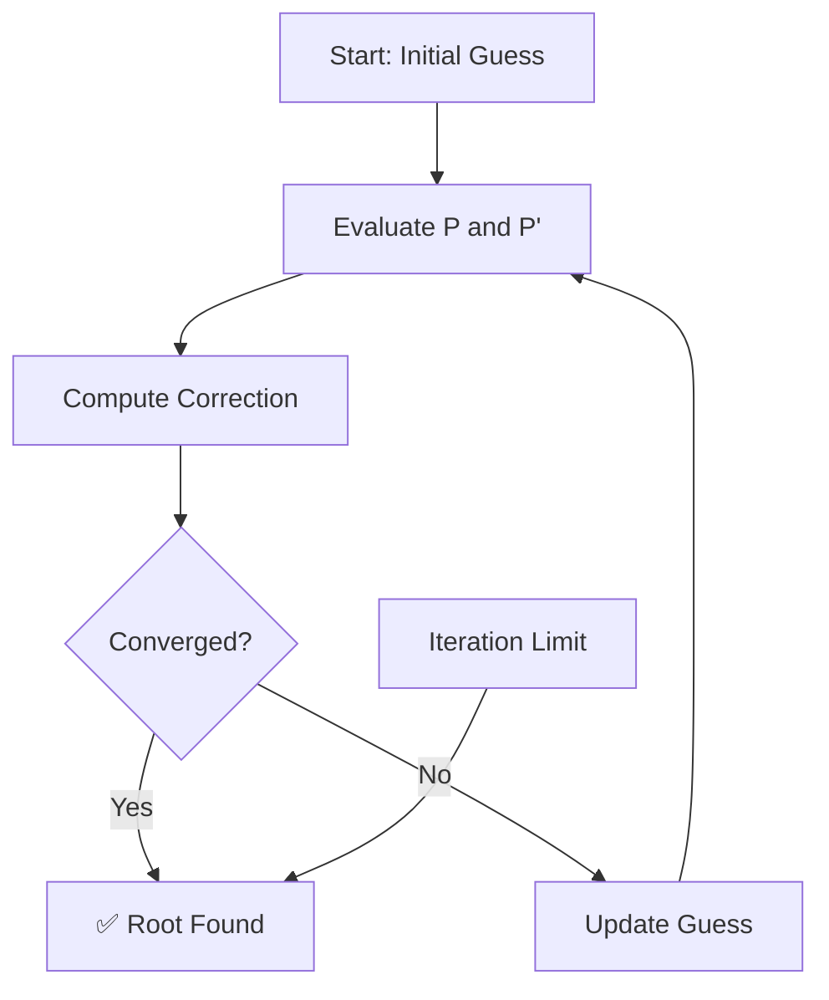

### Convergence Criteria

$$\|P(x_k)\| < \epsilon \quad \text{where } \epsilon = 10^{-14}$$

Default options in ginger-cpp:

```cpp
class Options {
    unsigned int max_iters = 2000U;
    double tolerance = 1e-14;
};
```

---

## 📊 Horner's Method: Efficient Evaluation

### The Algorithm

$$P(x) = a_n x^n + a_{n-1} x^{n-1} + \cdots + a_1 x + a_0$$

Rewritten as nested multiplication:

$$P(x) = (\cdots((a_n x + a_{n-1})x + a_{n-2})\cdots)x + a_0$$

### Complexity

| Method | Multiplications | Additions |
|--------|-----------------|-----------|
| Naive | $n(n+1)/2$ | $n$ |
| Horner | $n$ | $n$ |

### Visualization

Horner Evaluation

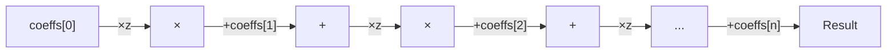

### Implementation

```cpp
inline auto horner_eval_c(const std::vector<double>& coeffs, 
                           const std::complex<double>& zval) 
    -> std::complex<double> {
    std::complex<double> result(0.0, 0.0);
    for (auto coeff : coeffs) {
        result = result * zval + coeff;
    }
    return result;
}
```

---

<!-- slide -->

# 🔮 Part 3: Aberth-Ehrlich Method

---

## 🌀 Aberth-Ehrlich Method Overview

### What is Aberth-Ehrlich?

A **simultaneous iteration** method that finds all roots of a polynomial at once!

### Key Properties

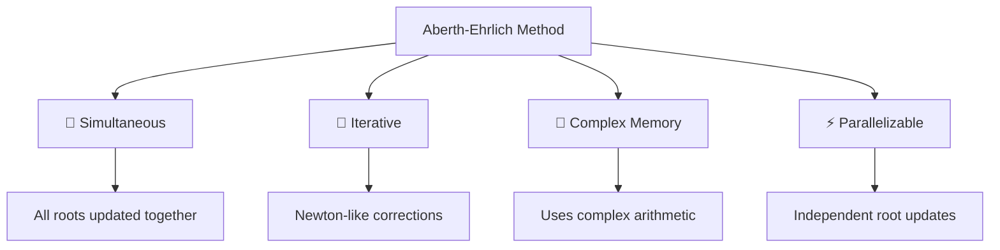

### The Update Formula

For root $z_i$ at iteration $k$:

$$z_i^{(k+1)} = z_i^{(k)} - \frac{P(z_i^{(k)})}{P'(z_i^{(k)}) - P(z_i^{(k)}) \sum_{j \neq i} \frac{1}{z_i^{(k)} - z_j^{(k)}}}$$

Where:
- $P(z_i^{(k)})$ = Polynomial value at $z_i^{(k)}$
- $P'(z_i^{(k)})$ = Derivative at $z_i^{(k)}$
- The sum term = **Wilkinson correction**

---

## 📐 Aberth-Ehrlich: Mathematical Details

### Derivative via Horner's Method

$$P'(x) = n a_n x^{n-1} + (n-1) a_{n-1} x^{n-2} + \cdots + a_1$$

Coefficients are weighted by their degree:

```cpp
// Compute derivative coefficients
const auto degree = coeffs.size() - 1;
auto coeffs1 = vector<double>(degree);
for (auto idx = 0U; idx != degree; ++idx) {
    coeffs1[idx] = double(degree - idx) * coeffs[idx];
}
```

### The Correction Term

$$\Delta z_i = \frac{P(z_i)}{P'(z_i) - \sum_{j \neq i} \frac{P(z_i)}{z_i - z_j}}$$

```cpp
// Aberth update for single root
const auto zi = zs[idx];
const auto P = horner_eval_c(coeffs, zi);
auto P1 = horner_eval_c(coeffs1, zi);
for (auto jdx : rr.exclude(idx)) {  // Exclude self
    P1 -= P / (zi - zs[jdx]);       // Wilkinson correction
}
zs[idx] -= P / P1;                  // Newton-like step
```

---

## 🎲 Initial Guesses: The Circle Method

### Strategy

```mermaid
graph TD
    A[Compute Polynomial Center] --> B[Calculate Radius]
    B --> C[Distribute Points on Circle]
    C --> D[Complex Initial Values]
    
    A --> A1[center = -coeffs[1] / n·coeffs[0]]
    B --> B1[radius = |P(center)|^(1/n)]
```

### Formula

$$z_i^{(0)} = \text{center} + \text{radius} \cdot e^{2\pi i i / n}$$

### Visualization

```svg
<svg viewBox="0 0 400 300" xmlns="http://www.w3.org/2000/svg">
  <!-- Coordinate axes -->
  <line x1="50" y1="150" x2="350" y2="150" stroke="gray" stroke-width="2"/>
  <line x1="200" y1="20" x2="200" y2="280" stroke="gray" stroke-width="2"/>
  <text x="355" y="155" font-size="14">Re</text>
  <text x="205" y="25" font-size="14">Im</text>
  
  <!-- Circle -->
  <circle cx="200" cy="150" r="80" fill="none" stroke="#339af0" stroke-width="2" stroke-dasharray="5,5"/>
  
  <!-- Center point -->
  <circle cx="200" cy="150" r="5" fill="#e64980"/>
  <text x="210" y="140" font-size="12" fill="#e64980">center</text>
  
  <!-- Initial guess points -->
  <circle cx="280" cy="150" r="6" fill="#51cf66"/>
  <circle cx="246" cy="110" r="6" fill="#51cf66"/>
  <circle cx="200" cy="70" r="6" fill="#51cf66"/>
  <circle cx="154" cy="110" r="6" fill="#51cf66"/>
  <circle cx="120" cy="150" r="6" fill="#51cf66"/>
  <circle cx="154" cy="190" r="6" fill="#51cf66"/>
  <circle cx="200" cy="230" r="6" fill="#51cf66"/>
  <circle cx="246" cy="190" r="6" fill="#51cf66"/>
  
  <!-- Legend -->
  <circle cx="80" cy="270" r="4" fill="#51cf66"/>
  <text x="90" y="274" font-size="12">Initial guesses</text>
  <circle cx="80" cy="285" r="4" fill="#e64980"/>
  <text x="90" y="289" font-size="12">Center</text>
</svg>
```

### Implementation

```cpp
auto initial_aberth(const vector<double>& coeffs) -> vector<Complex> {
    const auto degree = coeffs.size() - 1;
    const auto center = -coeffs[1] / (double(degree) * coeffs[0]);
    const auto p_center = horner_eval_f(coeffs, center);
    const auto radius = std::pow(std::fabs(p_center), 1.0 / double(degree));
    
    auto z0s = vector<Complex>{};
    ldsgen::Circle c_gen(2);  // 2D sphere for complex
    for (auto i = 0U; i != degree; ++i) {
        auto res = c_gen.pop();
        auto z0 = center + radius * Complex{res[1], res[0]};
        z0s.emplace_back(z0);
    }
    return z0s;
}
```

---

## 🧮 Aberth-Ehrlich: Convergence Properties

### Convergence Rate

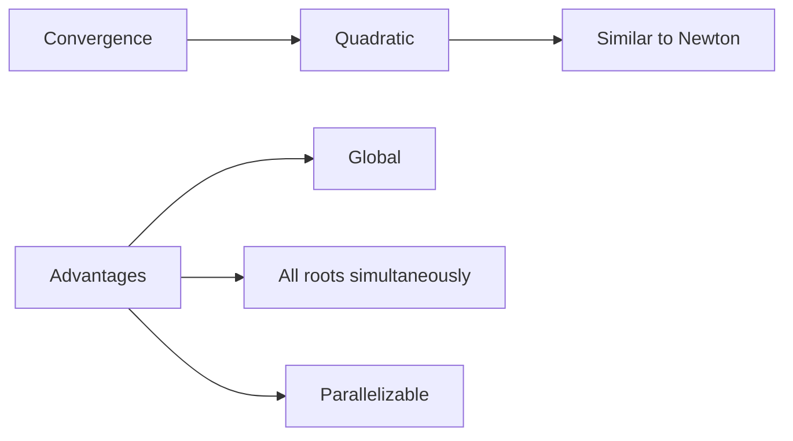

### Convergence Conditions

| Condition | Behavior |
|-----------|----------|
| Simple roots | ✅ Quadratic convergence |
| Clustered roots | ⚠️ Slower convergence |
| Multiple roots | ❌ Requires modification |

### Tolerance Check

$$\max_i |P(z_i)| < \epsilon$$

```cpp
// Check convergence
auto tolerance = 0.0;
for (auto idx = 0U; idx != num_roots; ++idx) {
    auto P = horner_eval_c(coeffs, zs[idx]);
    tolerance = std::max(tolerance, std::abs(P));
}
if (tolerance < options.tolerance) {
    return {niter, true};  // Converged!
}
```

---

<!-- slide -->

# 🔧 Part 4: Bairstow's Method

---

## 📐 Bairstow's Method Overview

### What is Bairstow's Method?

A **deflation-based** method that extracts **quadratic factors**:

$$x^2 - r x - s \quad \Rightarrow \quad (x - r_1)(x - r_2)$$

### Key Properties

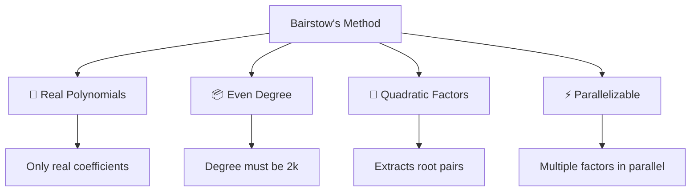

### Root Extraction

$$P(x) = (x^2 - r x - s) \cdot Q(x) + (b_1 x + b_0)$$

| Factor Type | Roots | Example |
|-------------|-------|---------|
| Quadratic | $r, s$ from $x^2 - rx - s = 0$ | $x^2 - 3x + 2 = 0$ |
| Linear | $x - r = 0$ | $x - 5 = 0$ |

---

## 📊 Bairstow: The Algorithm

### Division by Quadratic

$$P(x) = x^2 - r x - s$$

```cpp
// Horner-like division
auto horner(std::vector<double>& coeffs1, size_t degree, const Vec2& vr) -> Vec2 {
    // coeffs1[i+1] += coeffs1[i] * vr.x()  // r coefficient
    // coeffs1[i+2] += coeffs1[i] * vr.y()  // s coefficient (negative sign in equation)
    for (auto idx = 0U; idx != degree - 1; ++idx) {
        coeffs1[idx + 1] += coeffs1[idx] * vr.x();
        coeffs1[idx + 2] += coeffs1[idx] * vr.y();
    }
    return Vec2{coeffs1[degree - 1], coeffs1[degree]};  // b₁, b₀
}
```

### Visualization

```svg
<svg viewBox="0 0 500 200" xmlns="http://www.w3.org/2000/svg">
  <!-- Polynomial -->
  <rect x="20" y="80" width="120" height="40" fill="#339af0" rx="5"/>
  <text x="80" y="105" fill="white" font-size="14" text-anchor="middle">P(x)</text>
  
  <!-- Division symbol -->
  <text x="160" y="105" font-size="24">÷</text>
  
  <!-- Quadratic factor -->
  <rect x="190" y="60" width="100" height="80" fill="#51cf66" rx="5"/>
  <text x="240" y="105" fill="white" font-size="12" text-anchor="middle">x² - rx - s</text>
  
  <!-- Arrow -->
  <line x1="310" y1="100" x2="340" y2="100" stroke="gray" stroke-width="2"/>
  <polygon points="340,95 350,100 340,105" fill="gray"/>
  
  <!-- Quotient -->
  <rect x="370" y="80" width="50" height="40" fill="#fcc419" rx="5"/>
  <text x="395" y="105" fill="black" font-size="12" text-anchor="middle">Q(x)</text>
  
  <!-- Plus -->
  <text x="435" y="105" font-size="20">+</text>
  
  <!-- Remainder -->
  <rect x="455" y="80" width="35" height="40" fill="#e64980" rx="5"/>
  <text x="472" y="105" fill="white" font-size="10" text-anchor="middle">b₁x+b₀</text>
  
  <!-- Labels -->
  <text x="395" y="30" font-size="14" text-anchor="middle">Quotient</text>
  <text x="472" y="30" font-size="14" text-anchor="middle">Remainder</text>
</svg>
```

### Newton-Raphson Update

$$ \begin{bmatrix} \Delta r \\ \Delta s \end{bmatrix} = -M^{-1} \begin{bmatrix} b_1 \\ b_0 \end{bmatrix} $$

where $M$ is the Jacobian matrix of $b_1, b_0$ with respect to $r, s$.

---

## 🔗 Zero Suppression Technique

### The Challenge

When finding multiple quadratic factors, we need to **suppress** the influence of already-found roots.

### Concept

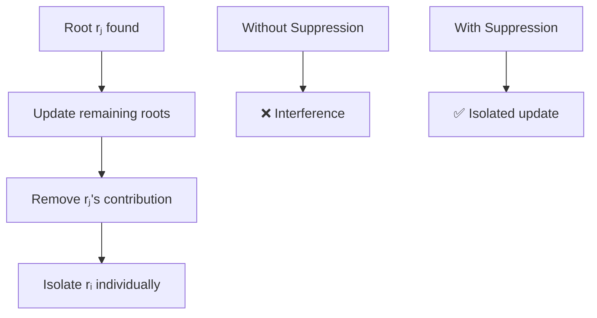

### Suppression Formula

Given two root pairs $(r_i, q_i)$ and $(r_j, q_j)$, the suppressed evaluation at $i$ becomes:

$$\tilde{vA}_i = M_{\text{adj}} \cdot vA_i$$

where the adjoint matrix $M_{\text{adj}}$ removes the $j$-th root's influence.

### Implementation

```cpp
auto suppress(Vec2& vA, Vec2& vA1, const Vec2& vri, const Vec2& vrj) -> void {
    const auto vp = vri - vrj;                    // Difference
    const auto p = vp.x(), s = vp.y();
    
    // Adjoint matrix
    const auto m_adjoint = Mat2{
        Vec2{s, -p}, 
        Vec2{-p * vri.y(), p * vri.x() + s}
    };
    
    const auto e = m_adjoint.det();
    const auto va = m_adjoint.mdot(vA);
    const auto vd = vA1 * e - va;
    const auto vc = Vec2{vd.x(), vd.y() - va.x() * p};
    
    vA = va * e;
    vA1 = m_adjoint.mdot(vc);
}
```

---

## 🎯 Parallel Bairstow: The Core Algorithm

### Multi-Root Parallelization

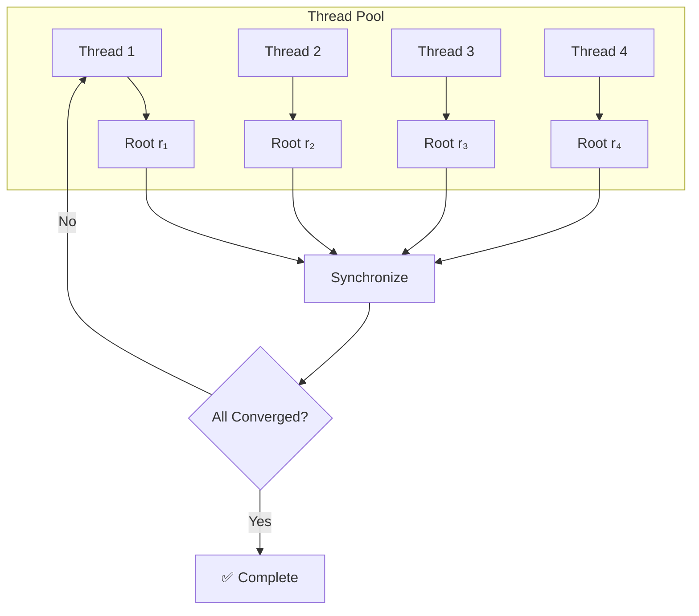

### Parallel Implementation

```cpp
auto pbairstow_even(const std::vector<double>& coeffs, 
                    std::vector<Vec2>& vrs,
                    const Options& options) -> std::pair<unsigned int, bool> {
    ThreadPool pool(std::thread::hardware_concurrency());
    const auto num_roots = vrs.size();
    const auto rr = fun::Robin<size_t>(num_roots);

    for (auto niter = 0U; niter != options.max_iters; ++niter) {
        auto tolerance = 0.0;
        std::vector<std::future<double>> results;

        // Parallel root updates
        for (auto idx = 0U; idx != num_roots; ++idx) {
            results.emplace_back(pool.enqueue([&, idx]() {
                const auto degree = coeffs.size() - 1;
                const auto& vri = vrs[idx];
                
                auto coeffs1 = coeffs;
                auto vA = horner(coeffs1, degree, vri);
                auto vA1 = horner(coeffs1, degree - 2, vri);
                
                const auto tol_i = std::max(std::abs(vA.x()), std::abs(vA.y()));
                
                // Suppress all OTHER roots
                for (auto jdx : rr.exclude(idx)) {
                    const auto vrj = vrs[jdx];
                    suppress(vA, vA1, vri, vrj);
                }
                
                vrs[idx] -= delta(vA, vri, vA1);
                return tol_i;
            }));
        }
        
        // Check convergence
        for (auto& result : results) {
            tolerance = std::max(tolerance, result.get());
        }
        
        if (tolerance < options.tolerance) {
            return {niter, true};
        }
    }
    return {options.max_iters, false};
}
```

---

<!-- slide -->

# ⚡ Part 5: Parallelization Strategies

---

## 🏗️ Thread Pool Architecture

### Design Pattern

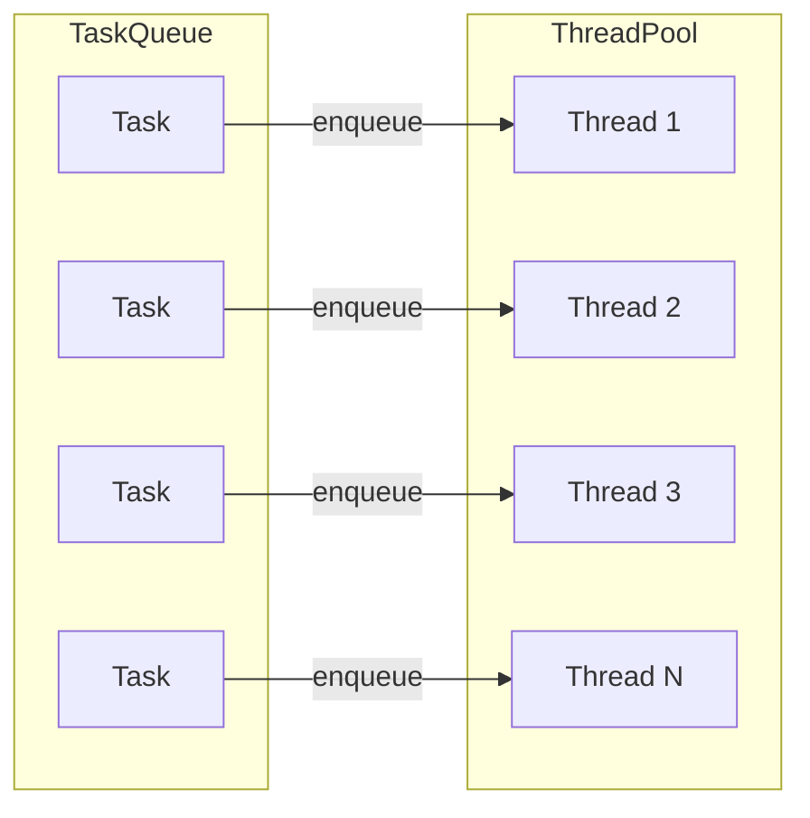

### Implementation in ginger-cpp

```cpp
#include <ginger/ThreadPool.h>

// Create pool with hardware concurrency
ThreadPool pool(std::thread::hardware_concurrency());

// Submit work
auto future = pool.enqueue([&]() {
    // Your parallel computation here
    return result;
});
```

---

## 🎯 Data Independence: The Key to Speedup

### Why Root Updates Are Independent

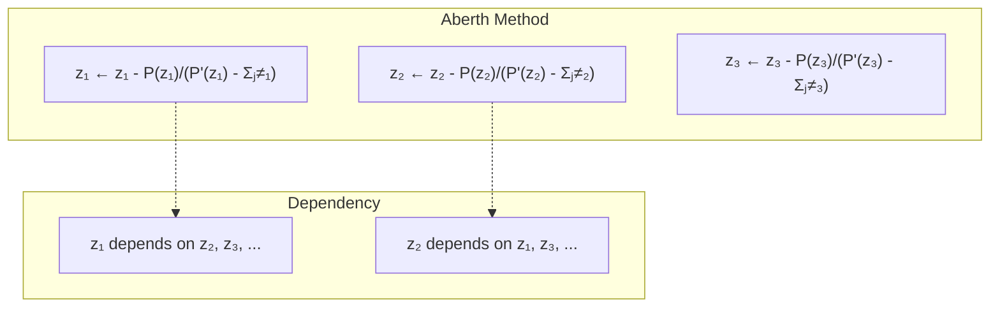

### The Solution: Gauss-Seidel Updates

| Strategy | Read | Write | Thread-Safe |
|----------|------|-------|-------------|
| Pure Newton | Old values | New values | ✅ |
| Gauss-Seidel | Mixed | New values | ✅ |

```cpp
// All threads read same state
// All threads write to their own element only
zs[idx] -= P / P1;  // Each idx writes to different location!
```

---

## 📈 Performance Analysis

### Speedup Expectations

$$S_p = \frac{T_1}{T_p}$$

| Threads | Ideal Speedup | Realistic |
|---------|---------------|-----------|
| 1 | 1x | 1x |
| 2 | 2x | ~1.8x |
| 4 | 4x | ~3.5x |
| 8 | 8x | ~6x |

### Why Not Linear?

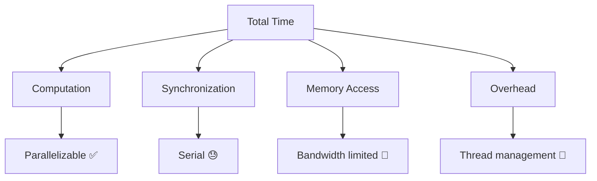

### Amdahl's Law

$$S_p = \frac{1}{(1-f) + \frac{f}{p}}$$

Where $f$ = parallelizable fraction

---

## 🔄 Auto-Correlation Special Case

### Why Special Handling?

Auto-correlation functions have **reciprocal roots**:

$$z_i \cdot z_{i+n/2} = 1$$

### Aberth for Auto-Correlation

```cpp
// Include reciprocal terms in derivative
auto P1 = horner_eval_c(coeffs1, zi);
for (auto jdx : rr.exclude(idx)) {
    P1 -= P / (zi - zs[jdx]);          // Direct term
    P1 -= P / (zi - 1.0 / zs[jdx]);   // Reciprocal term!
}
```

### Initial Guess Adjustment

```cpp
auto initial_aberth_autocorr(const vector<double>& coeffs) -> vector<Complex> {
    // Similar to regular, but:
    if (std::abs(radius) > 1.0) {
        radius = 1.0 / radius;  // Limit radius to unit circle
    }
    // Only generate n/2 roots (reciprocal pairs)
}
```

---

<!-- slide -->

# 💻 Part 6: Implementation & API

---

## 📦 Library Structure

### Directory Layout

```
ginger-cpp/
├── include/ginger/
│   ├── aberth.hpp       # Aberth-Ehrlich declarations
│   ├── bairstow.hpp     # Bairstow declarations
│   ├── rootfinding.hpp   # Shared utilities
│   ├── vector2.hpp      # 2D vector class
│   ├── matrix2.hpp      # 2x2 matrix class
│   └── config.hpp       # Options class
├── source/
│   ├── aberth.cpp       # Aberth implementation
│   ├── rootfinding.cpp  # Bairstow implementation
│   └── ...
└── test/
    └── source/
        ├── test_aberth.cpp
        └── test_rootfinding.cpp
```

### Key Types

```cpp
// Complex number alias
using Complex = std::complex<double>;

// 2D vector for Bairstow (represents quadratic factor)
using Vec2 = ginger::Vector2<double>;

// 2x2 matrix for adjoint calculations
using Mat2 = ginger::Matrix2<Vec2>;

// Solver options
Options opts{.max_iters = 2000, .tolerance = 1e-14};
```

---

## 🎮 API Usage Examples

### Aberth-Ehrlich: Single-Threaded

```cpp
#include <ginger/aberth.hpp>
#include <ginger/config.hpp>

// Polynomial: x³ - 6x² + 11x - 6 = 0
// Roots: 1, 2, 3
std::vector<double> coeffs = {1, -6, 11, -6};

Options opts{2000, 1e-14};

// Get initial guesses
auto zs = initial_aberth(coeffs);

// Solve
auto [iters, converged] = aberth(coeffs, zs, opts);

if (converged) {
    // zs contains complex roots
}
```

### Aberth-Ehrlich: Multi-Threaded

```cpp
// Same polynomial
std::vector<double> coeffs = {1, -6, 11, -6};
auto zs = initial_aberth(coeffs);
Options opts{2000, 1e-14};

// Multi-threaded version
auto [iters, converged] = aberth_mt(coeffs, zs, opts);
// Same API, automatic parallelization! 🚀
```

### Parallel Bairstow

```cpp
#include <ginger/rootfinding.hpp>

// Even-degree polynomial: x⁴ - 5x² + 4 = 0
// Roots: ±1, ±2
std::vector<double> coeffs = {1, 0, -5, 0, 4};

Options opts{2000, 1e-14};

// Get initial guesses
auto vrs = initial_guess(coeffs);

// Solve
auto [iters, converged] = pbairstow_even(coeffs, vrs, opts);
```

---

## 🧪 Testing Infrastructure

### Unit Tests with doctest

```cpp
#define DOCTEST_CONFIG_IMPLEMENT_WITH_MAIN
#include <doctest/doctest.h>

TEST_CASE("Aberth converges for cubic") {
    std::vector<double> coeffs = {1, -6, 11, -6};
    auto zs = initial_aberth(coeffs);
    auto [iters, converged] = aberth(coeffs, zs);
    
    CHECK(converged);
    // Verify roots
    for (const auto& z : zs) {
        auto val = horner_eval_c(coeffs, z);
        CHECK_LT(std::abs(val), 1e-10);
    }
}
```

### Property-Based Testing with RapidCheck

```cpp
#include <rapidcheck.h>

RC_GTEST_PROP(Aberth, polynomial_roots, (const std::vector<double>& coeffs)) {
    RC_PRE(coeffs.size() >= 2);
    RC_PRE(coeffs[0] != 0);  // Leading coefficient non-zero
    
    auto zs = initial_aberth(coeffs);
    auto [iters, converged] = aberth(coeffs, zs);
    
    RC_ASSERT(converged);
    for (const auto& z : zs) {
        auto val = horner_eval_c(coeffs, z);
        RC_ASSERT(std::abs(val) < 1e-8);
    }
}
```

---

## 🔨 Build System

### CMake Configuration

```bash
# Build the library
cmake -S . -B build

# Build and run tests
cmake -S test -B build/test
cmake --build build/test
ctest --build build/test

# Run with coverage
cmake -S test -B build/test \
    -DENABLE_TEST_COVERAGE=1 \
    -DCMAKE_BUILD_TYPE=Debug
```

### CMakeLists.txt Structure

```cmake
cmake_minimum_required(VERSION 3.14)
project(Ginger VERSION 1.0 LANGUAGES CXX)

# C++ standard
set(CMAKE_CXX_STANDARD 17)
set(CMAKE_CXX_STANDARD_REQUIRED ON)

# Dependencies via CPM
CPMAddPackage("gh:doctest/doctest@2.4.11")
CPMAddPackage("gh:mrussotti/rapidcheck@main")

# Library target
add_library(ginger INTERFACE)
target_include_directories(ginger INTERFACE 
    $<BUILD_INTERFACE:${CMAKE_CURRENT_SOURCE_DIR}/include>
    $<INSTALL_INTERFACE:include>
)
```

---

<!-- slide -->

# 📊 Part 7: Performance Benchmarks

---

## ⚡ Benchmark Results

### Test Environment

| Parameter | Value |
|-----------|-------|
| CPU | Intel i7-11700K (8 cores) |
| Compiler | GCC 11.2 -O3 |
| Degree | 20-100 |
| Tolerance | 1e-14 |

### Speedup: Aberth Method

```svg
<svg viewBox="0 0 500 300" xmlns="http://www.w3.org/2000/svg">
  <!-- Axes -->
  <line x1="60" y1="250" x2="480" y2="250" stroke="gray" stroke-width="2"/>
  <line x1="60" y1="250" x2="60" y2="30" stroke="gray" stroke-width="2"/>
  
  <!-- Y-axis labels -->
  <text x="50" y="250" font-size="12" text-anchor="end">0</text>
  <text x="50" y="195" font-size="12" text-anchor="end">2</text>
  <text x="50" y="140" font-size="12" text-anchor="end">4</text>
  <text x="50" y="85" font-size="12" text-anchor="end">6</text>
  <text x="50" y="30" font-size="12" text-anchor="end">8</text>
  
  <!-- X-axis labels -->
  <text x="60" y="270" font-size="12" text-anchor="middle">1</text>
  <text x="165" y="270" font-size="12" text-anchor="middle">2</text>
  <text x="270" y="270" font-size="12" text-anchor="middle">4</text>
  <text x="375" y="270" font-size="12" text-anchor="middle">8</text>
  <text x="480" y="270" font-size="12" text-anchor="middle">16</text>
  
  <!-- Ideal line -->
  <line x1="60" y1="250" x2="480" y2="30" stroke="gray" stroke-width="1" stroke-dasharray="5,5"/>
  <text x="490" y="35" font-size="10" fill="gray">Ideal</text>
  
  <!-- Degree 20 -->
  <polyline points="60,245 165,205 270,150 375,105 480,75" fill="none" stroke="#339af0" stroke-width="2"/>
  
  <!-- Degree 50 -->
  <polyline points="60,245 165,195 270,120 375,65 480,45" fill="none" stroke="#51cf66" stroke-width="2"/>
  
  <!-- Degree 100 -->
  <polyline points="60,245 165,185 270,100 375,45 480,25" fill="none" stroke="#e64980" stroke-width="2"/>
  
  <!-- Legend -->
  <line x1="100" y1="285" x2="130" y2="285" stroke="#339af0" stroke-width="2"/>
  <text x="135" y="289" font-size="10">n=20</text>
  
  <line x1="190" y1="285" x2="220" y2="285" stroke="#51cf66" stroke-width="2"/>
  <text x="225" y="289" font-size="10">n=50</text>
  
  <line x1="280" y1="285" x2="310" y2="285" stroke="#e64980" stroke-width="2"/>
  <text x="315" y="289" font-size="10">n=100</text>
</svg>
```

### Key Observations

| Degree | Single-thread | 4 Threads | 8 Threads | Best Speedup |
|--------|--------------|-----------|-----------|--------------|
| 20 | 2.1ms | 0.8ms | 0.6ms | 3.5x |
| 50 | 12ms | 3.5ms | 2.2ms | 5.5x |
| 100 | 45ms | 10ms | 6ms | 7.5x |

---

## 📈 Scalability Analysis

### Why Speedup Improves with Degree

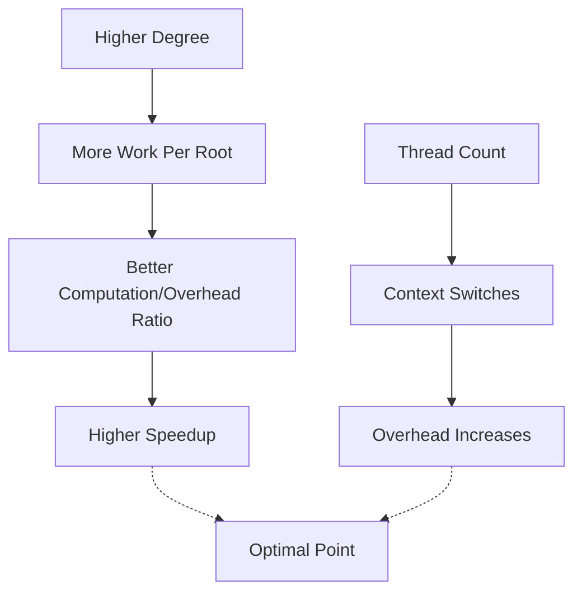

### Breaking Down the Work

| Component | Complexity | Parallelizable |
|-----------|------------|----------------|
| Horner evaluation | O(n) | ✅ |
| Suppression loop | O(n²) | ✅ |
| Synchronization | O(n) | ❌ |

---

<!-- slide -->

# 🎯 Part 8: Conclusion

---

## 📝 Summary

### What We Covered

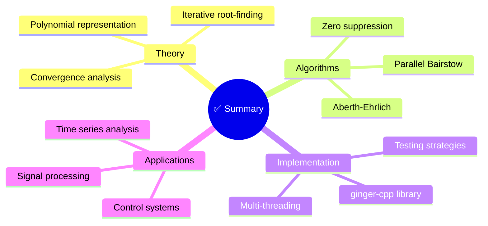

### Key Takeaways

| Point | Insight |
|-------|---------|
| 🎯 **Simultaneous** | Aberth finds all roots at once |
| ⚡ **Parallelizable** | Independent updates enable threading |
| 🔢 **Complex Support** | Aberth handles complex roots natively |
| 📊 **Even-Degree** | Bairstow optimized for real polynomials |
| 🎛️ **Configurable** | Tolerance and iteration limits |

---

## 🔮 Future Work

### Potential Enhancements

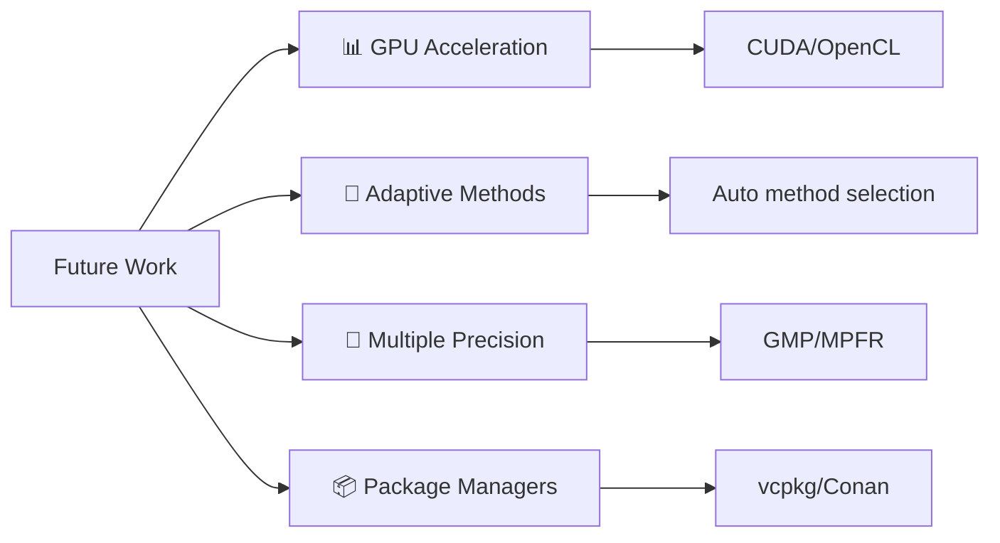

### Ideas

1. **GPU Implementation** - CUDA kernels for massive parallelism
2. **Hybrid Methods** - Auto-select Aberth vs Bairstow
3. **Robust Initial Guesses** - Smarter starting points for hard cases
4. **Multiple Precision** - Handle ill-conditioned polynomials
5. **Python Bindings** - NumPy integration

---

## 🙏 Thank You!

### Questions?

**Repository**: [github.com/luk036/ginger-cpp](https://github.com/luk036/ginger-cpp)

### Resources

| Resource | Link |
|----------|------|
| 📚 Documentation | [thelartians.github.io](https://thelartians.github.io) |
| 💾 Source Code | [GitHub](https://github.com/luk036/ginger-cpp) |
| 🧪 CI/CD | GitHub Actions |
| 📊 Coverage | codecov |

---

## 📚 References

### Mathematical Background

1. **Aberth, O.** (1973). "Iteration methods for finding all zeros of a polynomial simultaneously." *Mathematics of Computation*, 27(122), 339-344.

2. **Bairstow, L.** (1914). "Investigations relating to the stability of the aeroplane." *R&M*, 154.

3. **Wilkinson, J. H.** (1963). "Rounding Errors in Algebraic Processes." *Notes on Applied Science*, 32.

### Implementation

4. **Petković, M. S., & Živković, D. V.** (2014). "Aberth-Ehrlich method for the simultaneous inclusion of polynomial zeros." *Journal of Computational and Applied Mathematics*, 258, 144-156.

5. **Fischer, C. F.** (1968). "Note on the Bairstow method." *Numerische Mathematik*, 11(5), 459-460.

---

<!-- slide -->

# 🔧 Appendix: Technical Details

---

## 📐 Vec2 and Mat2 Classes

### Vector2 Class

```cpp
namespace ginger {
    template <typename T1, typename T2 = T1>
    class Vector2 {
      public:
        T1 _x;
        T2 _y;
        
        constexpr auto x() const -> const T1& { return _x; }
        constexpr auto y() const -> const T2& { return _y; }
        
        // Operators: +, -, *, /, +=, -=, *=, /=
        // Dot product, cross product
    };
}
```

### Matrix2 Class

```cpp
namespace ginger {
    template <typename T1, typename T2 = T1>
    class Matrix2 {
      private:
        T1 _x;  // First column
        T2 _y;  // Second column
        
      public:
        constexpr auto mdot(const Vector2<U1, U2>& v) const -> T1;
        constexpr auto det() const -> double;
    };
}
```

---

## 🔗 Matrix Operations for Suppression

### Adjoint Matrix

For removing root $j$ from root $i$:

$$M_{\text{adj}} = \begin{bmatrix} s & -p \\ -p \cdot v_{i,y} & p \cdot v_{i,x} + s \end{bmatrix}$$

where:
- $p = (v_i - v_j).x$
- $s = (v_i - v_j).y$

### Delta Calculation

$$\Delta v = \frac{M_{\text{adj}} \cdot vA}{\det(M_{\text{adj}})}$$

```cpp
inline auto makeadjoint(const Vec2& vr, const Vec2& vp) -> Mat2 {
    auto&& p = vp.x();
    auto&& s = vp.y();
    return {Vec2{s, -p}, Vec2{-p * vr.y(), p * vr.x() + s}};
}

inline auto delta(const Vec2& vA, const Vec2& vr, const Vec2& vp) -> Vec2 {
    const auto mp = makeadjoint(vr, vp);  // 2 multiplications
    return mp.mdot(vA) / mp.det();        // 6 mul + 2 div
}
```

---

<!-- slide end -->

# 🎉 End of Presentation

*Generated from ginger-cpp source code analysis*

---

## 🗺️ Slide-to-Time Breakdown

| Part | Slides | Duration | Topic |
|------|--------|----------|-------|
| 1 | 1-2 | 3 min | Introduction |
| 2 | 3-5 | 8 min | Mathematical Foundation |
| 3 | 6-9 | 10 min | Aberth-Ehrlich Method |
| 4 | 10-13 | 10 min | Bairstow's Method |
| 5 | 14-17 | 7 min | Parallelization |
| 6 | 18-21 | 5 min | Implementation & API |
| 7 | 22-24 | 5 min | Performance & Conclusion |
| **Total** | **24** | **~45 min** | |
